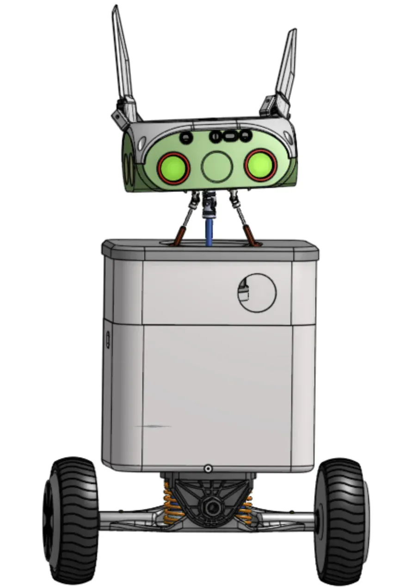
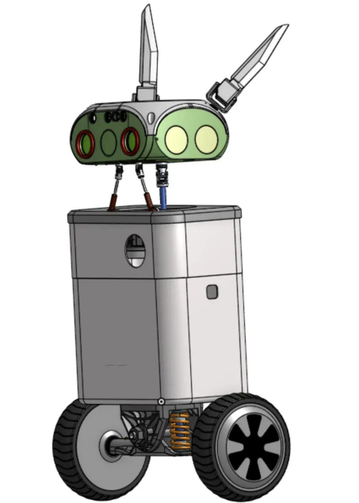
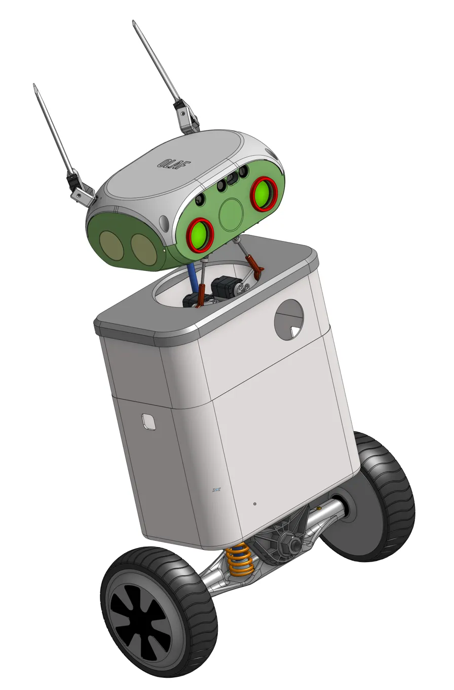

# OLAF 🤖

**Open-source AI companion proving embodied AI belongs to builders, not just consumers**


---

## Concept Design

<p align="center">
  
  
  
</p>

---

## What is OLAF?

OLAF is a self-balancing AI companion robot designed to demonstrate that anyone with passion, a 3D printer, and access to modern tools (LLMs, SBCs, affordable electronics) can build their own JARVIS or R2D2.

Unlike commercial AI assistants that position users as passive consumers, OLAF embodies a different philosophy: **when you BUILD your AI partner, it becomes a true collaborator, not a servant.**

OLAF combines:
- **R2D2-style personality** through coordinated expression (round TFT eyes, articulated ears, heart LCD, beeps)
- **Autonomous mobility** with self-balancing hoverboard base and SLAM navigation
- **Conversational AI** powered by hybrid local/cloud intelligence (Hailo Whisper + Claude/GPT-4)
- **Floor projection** for visual information display
- **Full documentation** of every design decision, success, and failure

---

## Why OLAF Matters

The technology to build advanced AI companions is now accessible to individual builders:
- **3D printing** has democratized custom hardware
- **LLMs** provide powerful coding assistance and reasoning
- **Modern SBCs** (Raspberry Pi 5 + Hailo AI Kit) bring 13 TOPS of AI acceleration at $150
- **ESP32-S3 modules** enable sophisticated distributed control at $5/unit

Big tech focuses on bringing AI assistants *to* the masses. OLAF proves a different thesis: **the most meaningful AI companions will be the ones people build themselves** - growing alongside their creators through adaptation and co-evolution.

---

## Technical Approach

OLAF uses a three-layer modular architecture optimized for power efficiency, low latency, and builder accessibility:

### **Module Layer** (4× ESP32-S3 Smart Peripherals)

Four independent ESP32-S3-WROOM-2 modules handle dedicated functions via I2C:

- **Head Module** (0x08): 2× GC9A01 round TFT eyes (1.28", 240×240, SPI), mmWave presence sensor, microphone array, speaker
- **Ears + Neck Module** (0x09): 4× ear servos (UART1) + 3× neck servos (UART2) on shared ESP32, full upper-body articulation
- **Body Module** (0x0A): GC9A01 heart LCD (emotion display), WS2812B RGB LEDs, projector power control (optocoupler)
- **Base Module** (0x0B): Self-balancing at 200Hz with MPU6050 IMU, ODrive motor controller (UART1), kickstand servo (UART2)

**Key Decision**: I2C-only communication (no WiFi on ESP32s) achieves 5-20ms latency vs 80-200ms and saves 1000mA power. Dual UART interfaces enable simultaneous servo/motor control.

### **Orchestration Layer** (Raspberry Pi 5 + Hailo-8L)

ROS2 Humble framework coordinates all modules through dedicated driver nodes:
- `/olaf/personality_coordinator` - Expression synchronization across eyes, heart, ears, neck, beeps
- `/olaf/ai_agent` - Hailo Whisper (local STT) + Claude API (reasoning)
- `/olaf/navigation` - Cartographer SLAM + Nav2 path planning
- Hardware driver nodes bridge ROS2 topics to I2C registers (4× drivers for 4 modules)

### **Intelligence Layer** (Hybrid AI)

- **Local**: Hailo-8L accelerated Whisper (tiny/base) for <200ms speech-to-text
- **Cloud**: Claude 3.5 Sonnet for personality and reasoning (WiFi from Pi only)
- **Target**: <3s end-to-end AI response time (P90)

**Key Decision**: Closed-loop ODrive motor controller enables accurate SLAM odometry (±10cm) vs open-loop alternatives. 200Hz balancing PID runs on Base ESP32 for real-time guarantees.

---

## Documentation

**Core Documents:**
- [**Product Requirements Document (PRD)**](docs/prd/) - Complete feature requirements, success metrics, timeline
- [**Technical Architecture**](docs/architecture/) - Full system design, decisions, tradeoffs, protocols
- [**Epic List**](docs/prd/epic-list.md) - 13-epic development roadmap (see link for full details)

---

## Technical Highlights

| Component | Technology | Decision Rationale |
|-----------|------------|-------------------|
| **Communication** | I2C @ 400kHz-1MHz | 5-20ms latency vs 80-200ms WiFi, saves 1000mA |
| **Modules** | 4× ESP32-S3 (not 5) | Ears+Neck consolidated, Body module added for heart LCD |
| **ROS2 Nodes** | Pi only (no micro-ROS) | Simpler - ESP32s are smart I2C slaves |
| **Eye Displays** | GC9A01 Round TFT (SPI) | 60 FPS full-color (240×240) vs OLED monochrome |
| **Heart Display** | GC9A01 Round TFT (SPI) | Emotion-driven BPM animation (50-120 BPM) |
| **Servo Control** | Dual UART per ESP32 | Simultaneous control: ears+neck, motors+kickstand |
| **Motor Control** | ODrive v3.6 closed-loop | Accurate odometry for SLAM (±10cm) |
| **SLAM** | Google Cartographer | Lighter footprint than RTAB-Map |
| **Self-Balancing** | 200Hz PID on ESP32 | Pi can't guarantee real-time control |
| **Power** | 36V hoverboard battery | 2-4 hour runtime with buck converters |
| **AI Acceleration** | Hailo-8L (13 TOPS) | <200ms local STT vs 1-1.5s cloud |
| **Projector Power** | Optocoupler | Galvanic isolation for safety |

---

## Repository Structure

```
olaf/
├── docs/                       # PRD, architecture, epics, build guides
│   ├── prd/                    # Sharded PRD (12 epics)
│   └── architecture/           # Sharded architecture docs
├── modules/                    # ESP32-S3 firmware (4 hardware modules)
│   ├── head/                   # Round TFT eyes, presence sensor, audio
│   ├── ears_neck/              # Articulated ears + neck (shared ESP32)
│   ├── body/                   # Heart LCD, LEDs, projector control
│   └── base/                   # Self-balancing + odometry + kickstand
├── orchestrator/               # Raspberry Pi ROS2 nodes
│   ├── ros2_nodes/
│   │   ├── hardware_drivers/   # I2C bridge to 4× ESP32 modules
│   │   ├── personality/        # Expression coordination
│   │   ├── ai_integration/     # Whisper + Claude
│   │   └── navigation/         # SLAM + Nav2
│   └── ota_server/             # Wireless firmware updates
├── hardware/                   # 3D models, wiring, BOM
│   ├── 3d-models/              # STL files for 3D printing
│   ├── wiring/                 # Fritzing diagrams, schematics
│   └── bom/                    # Bills of materials
├── shared/                     # Common headers (I2C registers, protocols)
└── tools/                      # Diagnostics, testing utilities
```

---

## Current Status

**Development Timeline**: 28-39 weeks (7-10 months of weekend development)
**Budget**: ~$1000 USD (configurable: $400 minimal to $1000 full-featured)
**Build Approach**: Weekly progress updates with full transparency

**Milestones:**
- ✅ PRD and technical architecture complete
- ✅ 13-epic roadmap defined (design-first approach)
- ✅ 4-module I2C architecture finalized
- ✅ Epic 01: All 11 stories drafted and ready for implementation
- 🟡 Component sourcing (in progress)
- ⏳ Epic 01: Foundation & I2C Communication (ready to start)

---

## Build-in-Public

OLAF development follows complete transparency - documenting every decision, success, and failure:

- **Weekly LinkedIn posts** (2-3/week) - Progress updates, technical deep-dives, lessons learned
- **Epic milestone videos** (12 videos, 1 per epic) - Demonstrations and technical explanations
- **Reddit engagement** (1/week) - Community discussions and technical Q&A
- **GitHub activity** - All code, documentation, issues, discussions public from day one

This isn't just about building a robot - it's about proving that **individual builders can create sophisticated AI companions** and sharing that knowledge to enable a community.

---

## Tech Stack Summary

- **Robotics Framework**: ROS2 Humble (LTS until 2027)
- **Orchestrator**: Python 3.11 on Raspberry Pi OS 64-bit (Debian 12)
- **Firmware**: C++17 with Arduino/PlatformIO for ESP32-S3
- **AI**: Hailo Whisper (local) + Claude 3.5 Sonnet (cloud)
- **SLAM**: Google Cartographer + Nav2
- **Database**: SQLite for conversation history
- **OTA**: Flask HTTP server for wireless ESP32 firmware updates
- **Displays**: GC9A01 Round TFT (1.28", 240×240, SPI, 60 FPS)
- **Servos**: Feetech SCS0009 (ears) + STS3215 (neck, kickstand) via UART bus

---

## Architecture Overview

### 4-Module I2C Architecture

```
┌─────────────────────────────────────────┐
│    ORCHESTRATION (Raspberry Pi 5)      │
│         ROS2 Humble + Hailo-8L          │
└──┬─────────┬─────────┬─────────┬────────┘
   │ I2C     │ I2C     │ I2C     │ I2C
   │ 0x08    │ 0x09    │ 0x0A    │ 0x0B
   ↓         ↓         ↓         ↓
┌──────┐ ┌──────────┐ ┌──────┐ ┌──────┐
│ HEAD │ │EARS+NECK │ │ BODY │ │ BASE │
│ESP32 │ │  ESP32   │ │ESP32 │ │ESP32 │
└──┬───┘ └─┬────┬───┘ └─┬──┬─┘ └─┬──┬─┘
   │ SPI   │    │       │  │     │  │
   │       │    │       │  │     │  │
   ↓       ↓    ↓       ↓  ↓     ↓  ↓
 Eyes   Ears Neck    Heart LEDs ODrv Stand
(GC9A01) (4×) (3×)  (GC9A01)    (UART)(UART)
```

**Communication Protocols:**
- **I2C**: Pi ↔ All ESP32-S3 modules (commands, sensor data, 5-20ms latency)
- **SPI**: ESP32 → GC9A01 displays (eyes + heart, 60 FPS rendering)
- **UART**: ESP32 → servo controllers, motor controllers (dual UART per module)
- **WiFi**: Pi → Cloud AI APIs only (Claude/GPT-4)

---

## Getting Started

> **Note**: OLAF is in early development (Epic 01). Complete build guides will be published as each epic is completed.

**Prerequisites for builders:**
- Soldering experience
- 3D printer access
- Basic electronics and programming knowledge
- Budget: ~$400-1000 (configurable based on component choices)

**Configuration Tiers:**
- **Minimal OLAF (~$400)**: Head (eyes, mic, speaker) + Ears + Neck + Body (heart LCD) - Personality focus
- **Standard OLAF (~$700)**: Minimal + Hoverboard base + Basic RGBD camera - Adds mobility
- **Full OLAF (~$1000)**: Standard + Floor projector + High-quality RGBD camera - Complete feature set

---

### Development Setup

📖 **[Setup Instructions](docs/user-guide/setup-instructions.md)** - Complete guide to hybrid PC+Pi development workflow

**Quick overview:**
- Develop on your PC (runs application nodes)
- Raspberry Pi handles hardware (runs driver nodes for I2C communication)
- They talk over WiFi via ROS2
- Deploy to Pi for production—same code, zero changes

---

## Contributing

OLAF welcomes contributions from the builder community! Once the core framework is proven (post-Epic 01), contributions can include:

- Building your own OLAF variant and sharing improvements
- Creating additional modules following the architecture
- Enhancing documentation and tutorials
- Reporting issues and suggesting features
- Sharing integration guides for new hardware

See [CONTRIBUTING.md](CONTRIBUTING.md) for guidelines (coming soon).

---

## Inspiration

- **R2D2** (Star Wars) - Expressive non-verbal communication through beeps and movement
- **Chappie** (Film) - Articulated ears and emotional personality development
- **Wall-E** (Film) - Personality conveyed through motion and sound design
- **Linux Movement** - Community-driven open-source alternative to commercial products

---

## License

MIT License - See [LICENSE](LICENSE) for details.

---

## Follow the Journey

- **GitHub Issues**: Questions, discussions, and feature requests welcome
- **LinkedIn**: Weekly progress updates and physical AI insights
- **YouTube**: Epic milestone demonstrations and technical deep-dives (12 videos planned)
- **Reddit**: r/robotics, r/ROS, r/DIYrobotics community engagement

---

*"The Linux moment for physical AI - proving embodied intelligence belongs to builders, not just consumers."*

**Latest Update**: October 2025 | **Current Epic**: 01 - Foundation & I2C Communication (Stories 1.1-1.11 drafted)
