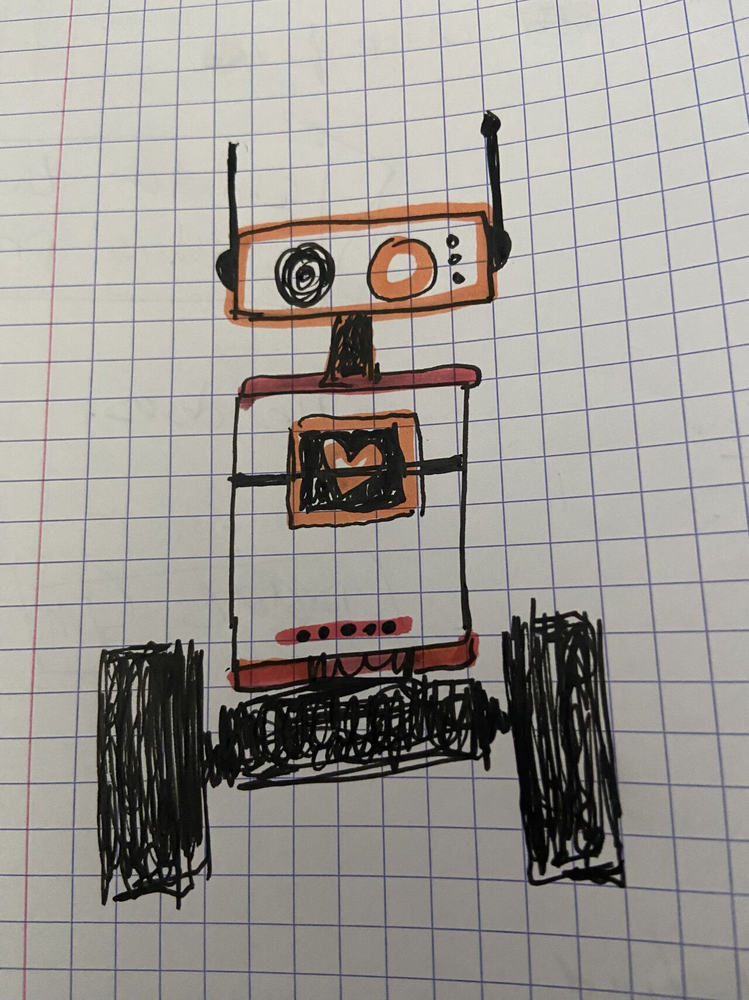
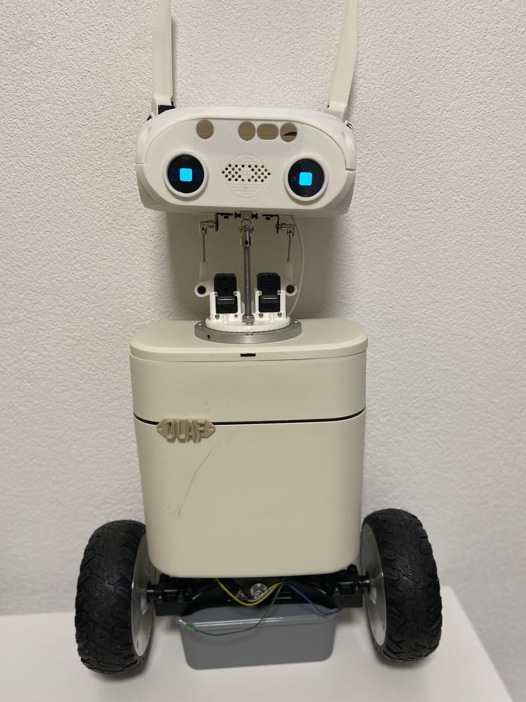

# 🤖 OLAF

**An open-source AI companion robot. Built in public.**

[](https://www.youtube.com/shorts/qg81DIB4Nmw)

## The Journey: 20 Weeks and Counting

<table>
  <tr>
    <td width="33%" align="center">
      <br>
      <b>Week 0</b><br>Initial concept sketch
    </td>
    <td width="33%" align="center">
      <br>
      <b>Week 8</b><br>3D CAD design complete
    </td>
    <td width="33%" align="center">
      <br>
      <b>Week 20</b><br>First light! Eyes blinking (build in progress)
    </td>
  </tr>
</table>

**An active build-in-public project.** Built while relocating cities and starting a new job. Learning CAD, ROS2, embedded systems, and AI integration as I go—all with AI coding assistants accelerating development. The journey continues!

---

## 📹 Demo Videos

### May 2026
- **OLAF expression cycling** — *2026-05-20* — the expression engine cycling through OLAF's authored emotions on real hardware (OLED eyes, articulated ears, 3-DOF neck). [▶ Watch on YouTube](https://youtube.com/shorts/9D4Txb85EnM)

---

## What is OLAF?

OLAF is a **personality-first robotics framework** that brings AI agents into physical form. Think R2D2's charm meeting modern AI capabilities—a 2-3 foot tall companion that communicates through expressive OLED eyes, articulated ears (Chappie-inspired), animated heart display, R2D2-style beeps, and LED indicators for status visualization.

**This is not another voice assistant in a box.**

When you BUILD your AI companion, something fundamental changes. It becomes a partner, not a servant. JARVIS challenges Tony Stark's ideas. R2D2 takes initiative. The difference? Tony BUILT JARVIS. Luke CHOSE R2D2 and they grew together. **Building creates relationship, and relationship enables true collaboration.**

---

## The Problem We're Solving

AI assistants (Alexa, Siri, ChatGPT, Claude) have impressive reasoning but remain fundamentally **disembodied**—trapped in screens and speakers. Meanwhile, building physical AI with personality forces impossible choices:

| Option | What You Get | What You Lose |
|--------|-------------|---------------|
| **Commercial robots** (Boston Dynamics, Vector) | Polish, capability | $1000s+, closed-source, no customization |
| **Educational platforms** (Poppy, Niryo) | Modularity, learning | AI integration, personality, high cost |
| **ROS2 robots** (Linorobot2, Andino) | Excellent navigation | Zero personality, assistant features |
| **Hobbyist kits** (Otto DIY) | Affordable, charming | Limited capabilities, no AI |
| **Closed AI robots** (HIWONDER) | AI + robotics bridge | Generic design, closed ecosystem |

**The Core Gap:** No open-source framework integrates modular architecture + AI conversation + personality expression + practical assistance + maker-accessible approach + community ecosystem.

**The Opportunity:** All the pieces are finally here—3D printers, powerful LLMs, modern SBCs (Raspberry Pi 5), AI coding assistants, local AI accelerators (Hailo). **This is the democratization moment.** The future of embodied AI belongs to builders, not just consumers.

---

## Architecture: Three Layers, Five Modules

### The Three-Layer Design

> **Repo scope (Phase 2, 2026-05-15).** This repository is the **OLAF body / expression engine** — the Orchestration + Module layers below. The Intelligence Layer (STT, reasoning, personality, mood/emotion decisions) is a **separate sibling project, `olaf_companion`**, which publishes 4 canonical ROS 2 topics (`mood`, `activity`, `speech_emotion`, `vocalization`). This repo subscribes to those and renders them on the body. The "personality-first" vision is unchanged at the *system* level; it's just split across two repos. See `docs/sprint-change-proposal-2026-05-15.md`.

```
┌─────────────────────────────────────────────────────────────────┐
│   INTELLIGENCE LAYER (Hybrid AI) — sibling repo olaf_companion  │
│                                                                 │
│  Local AI (Hailo-accelerated):                                 │
│    • Whisper STT (<200ms latency)                              │
│    • Real-time vision processing                               │
│                                                                 │
│  Cloud AI Agents (Claude/GPT-4):                               │
│    • Natural language understanding                            │
│    • Complex reasoning & decision-making                       │
│    • Tool use, function calling, multi-step planning           │
│                                                                 │
└──────────────────────┬──────────────────────────────────────────┘
                       │ HTTPS/REST + Local Inference
                       │
┌──────────────────────▼──────────────────────────────────────────┐
│              ORCHESTRATION LAYER                                │
│      Raspberry Pi 5 16GB + Fusion HAT+ + Hailo AI Kit          │
│               Ubuntu 24.04 • ROS2 Jazzy                         │
│                                                                 │
│  • Expression Engine (subscribes to olaf_companion's 4 topics) │
│  • Renders pose/LED/eye/heart from expression_map.yaml         │
│  • SLAM Navigation (Cartographer) — deferred                   │
│  • Direct Hardware Control (servos, LEDs, kickstand via HAT)   │
│  • I2C Master for ESP32 modules                                │
│                                                                 │
└──┬───────┬───────┬─────────────────┬───────────────────────────┘
   │       │       │                 │
   │I2C    │USB×2  │HAT WS2812       │HAT PWM
   │       │       │                 │
┌──▼───┐ ┌─▼─────────────┐ ┌────────▼───┐ ┌──▼──────┐
│ HEAD │ │ WAVESHARE USB │ │ INDICATOR  │ │KICKSTAND│
│ESP32 │ │ Neck + Ears   │ │ 24 LEDs    │ │ Servos  │
│(0x10)│ │ Servo Adapters│ │ (3 strips) │ │(at base)│
└──────┘ └───────────────┘ └────────────┘ └─────────┘
┌──▼───┐
│ BASE │
│ESP32 │
│(0x11)│
└──────┘
```

### The Five Modules (MECE Principle)

Each module owns its domain exclusively—no cross-dependencies. **Hybrid control:** ESP32s for real-time tasks, Pi direct control for latency-tolerant hardware.

**1. HEAD Module (ESP32, I2C 0x10)**
- **Hardware:**
  - 2× GC9A01 round OLED eyes (240×240, SPI-driven 30-60 FPS)
  - ESP32-S3 for real-time eye animations
- **Personality:**
  - Animated eye expressions (happy, curious, thinking, confused, sad)
  - Smooth emotional transitions, blink patterns
- **Why ESP32:** 60 FPS animations require dedicated real-time control

**2. BASE Module (ESP32, I2C 0x11)**
- **Hardware:** Two-wheel inverted pendulum, hoverboard BLDC motors, ODrive v3.6 (UART), BNO085 9-axis AHRS (200Hz, on-chip sensor fusion)
- **Control:** 200Hz PID balancing loop (real-time guarantee on ESP32, Linux can't do this)
- **Mobility:** SLAM navigation, follow-me mode, obstacle avoidance
- **Why ESP32:** Self-balancing requires hard real-time guarantees

**3. NECK Module (Pi-controlled, USB Serial)**
- **Hardware:** 3× Feetech STS3215 servos (pan/tilt/roll), Waveshare Bus Servo Adapter
- **Personality:** Head orientation, expressive gestures (head tilts, nods, shakes)
- **Movement:** Smooth organic motion curves (easing functions, not mechanical jerks)
- **Why Pi Direct:** USB serial via Waveshare adapter—no soldering, plug-and-play

**4. EARS Module (Pi-controlled, USB Serial)**
- **Hardware:** 4× Feetech SCS0009 servos (2-DOF × 2 ears), Waveshare Bus Servo Adapter
- **Personality:** Chappie-inspired articulated ears for emotional expression
- **Expression:** Perked up = alert, drooping = sad, rotating = curious
- **Why Pi Direct:** USB serial via Waveshare adapter—no soldering, plug-and-play

**5. INDICATOR Module (Pi-controlled, Fusion HAT WS2812)**
- **Hardware:** 3× 8-LED WS2812 strips (24 LEDs total, daisy-chained)
- **Functions:**
  - Strip 1: Interaction state (listening, thinking, speaking)
  - Strip 2: Module status (health of all subsystems)
  - Strip 3: PID visualization (self-balancing feedback)
- **Why Pi Direct:** Single data line via Fusion HAT WS2812 port

**Additional Pi-Controlled Hardware:**
- **4" Heart Display:** Animated beating heart, status info (replaces dedicated Torso ESP32)
- **Kickstand:** 2× model plane landing gear servos via Fusion HAT PWM
- **Speaker:** I2S audio via Fusion HAT

### Why This Architecture?

**Hybrid Control Topology:**
- **ESP32s (2 only):** Real-time critical tasks (60 FPS eyes, 200Hz balancing)
- **Pi Direct (via Fusion HAT):** Everything else—servos, LEDs, kickstand
- **Result:** Minimal soldering, maximum reliability, fewer firmware projects

**Modular MECE (Mutually Exclusive, Collectively Exhaustive):**
- Each module completable in 1-2 weekend sprints
- Independent testing: modules work standalone before integration
- Progressive capability: robot functional with minimal modules, enhanced as you add more
- Community contribution: others can develop modules without touching core framework

**Hybrid Intelligence:**
- **Local AI (Hailo):** Fast sensing, <200ms STT eliminates cloud delay, privacy-friendly
- **Cloud Agents:** Sophisticated reasoning, tool use, multi-step planning
- Best of both worlds: speed + sophistication

**ROS2 Foundation:**
- Industry-standard robotics middleware (ROS2 Jazzy on Ubuntu 24.04)
- Proven pub/sub architecture for module communication
- Extensive ecosystem (SLAM, navigation, sensor fusion)
- 5 driver nodes: olaf_head, olaf_base, olaf_neck, olaf_ears, olaf_indicator

---

## Key Features

### Personality Expression (The Core Differentiator)

**Multi-channel coordinated expression:**
- 🎭 **OLED Eyes:** 7 emotion types × 5 intensity levels (35 unique expressions)
- 👂 **Articulated Ears:** Directional attention + emotional positioning
- 🎯 **Neck Movement:** 3-DOF gestures (pan/tilt/roll)
- ❤️ **Heart Display:** Beating rhythm synchronized with emotional state
- 💡 **LED Indicators:** Interaction state, module health, PID visualization
- 🎵 **R2D2 Beeps:** Musical intervals (not harsh tones), emotion-matched inflection
- 🎬 **Orchestrated Sync:** All channels coordinated <500ms for unified emotional states

**Example:** "Express excitement level 4"
→ Orchestrator sends commands to Head (eyes wide, pupils dilated), Ears (perked forward), Neck (small bouncing motion), Heart (racing animation), Indicators (fast pulse)
→ Result: Coherent excited expression across all channels

### Intelligence & Interaction

- 🗣️ **Voice-first input:** Microphone + Hailo Whisper STT (<200ms local processing)
- 🧠 **Cloud AI agents:** Claude/GPT-4 for natural language, reasoning, tool use
- 🔊 **Context maintenance:** SQLite conversation history, user preferences across power cycles
- 🎯 **Function routing:** AI decides which modules to activate (display, movement, expression)
- 👁️ **Vision:** RGBD camera for SLAM, obstacle detection, person following

### Mobility & Navigation

- 🚶 **Self-balancing base:** Two-wheel inverted pendulum (saves floor space vs. 4-wheel)
- 🗺️ **SLAM navigation:** Google Cartographer for autonomous apartment navigation
- 👤 **Follow-me mode:** Vision-based person tracking + Nav2 path planning
- 🛑 **Obstacle avoidance:** Real-time depth sensing (RGBD camera)

---


## Current Status

**🔄 Active Development (Week 20):**

This is a work-in-progress build. The journey from sketch to functioning robot continues!

**What's Working:**
- ✅ Head module: OLED eyes blinking with cyan animations
- ✅ 3D CAD design complete for all modules
- ✅ Initial firmware for head module operational
- ✅ Modular architecture validated conceptually
- ✅ Architecture pivot to Fusion HAT (reduced from 4 ESP32s to 2)

**Currently Building:**
- 🔨 Physical assembly of remaining modules (ears, neck, base)
- 🔨 3D printing and fitting parts
- 🔨 ESP32 firmware for Head and Base modules
- 🔨 USB servo communication for Neck and Ears
- 🔨 ROS2 Jazzy integration layer

**Not Yet Started:**
- ⏳ AI intelligence layer (now the sibling `olaf_companion` pipeline)
- ⏳ Expression engine (Phase 2: renders olaf_companion's 4 canonical topics)
- ⏳ SLAM navigation
- ⏳ Self-balancing base with PID tuning
- ⏳ WS2812 indicator animations

**Realistic Timeline:**
This is a complex build being done in spare time while working full-time. Progress is incremental, iterative, and fully documented as it happens.


---

## Repository Organization

**Module-first structure.** Everything for a module lives in one place.

```
modules/
├── head/             # OLED eyes (ESP32, I2C 0x10)
├── base/             # Self-balancing (ESP32, I2C 0x11)
├── neck/             # 3-DOF servos (Pi USB serial)
├── ears/             # Articulated ears (Pi USB serial)
├── indicator/        # WS2812 LED strips (Pi Fusion HAT)
└── shared/           # Shared ESP32 libraries
```

**ESP32 modules** (head, base) contain:
- `firmware/` - ESP32 code (PlatformIO)
- `hardware/` - 3D models + BOM
- `tests/` - Module-specific tests
- `wiring.md` - Pin assignments, circuits

**Pi-controlled modules** (neck, ears, indicator) contain:
- `hardware/` - 3D models + BOM
- `tests/` - Integration tests
- `assembly.md` - Assembly guide

**ROS2 lives separately:**
```
ros2/src/
├── olaf_drivers/       # Driver logic (head_ears, neck, base, torso)
├── expression_engine/  # Phase 2: renders olaf_companion's 4 canonical topics
└── olaf_ai/            # (deferred) STT/agents now in olaf_companion
```

**Why this structure?**
- Work on one module without touching others
- Test modules independently
- Clear ownership boundaries
- Easy to contribute

**Full details:** See [repository-structure.md](docs/architecture/repository-structure.md)

---

## License & Credits

**License:** Open Source (TBD: MIT or Apache 2.0)

**Builder:** [Kamal Singh](https://www.linkedin.com/in/kamal-singh)
- 15 years in tech (5 at Amazon)
- 1 year intentional AI deep-dive
- MBA + Full-stack capability (hardware + software + AI)

**Inspiration:**
- R2D2 (Star Wars) - Non-verbal personality, beeps > words
- JARVIS (Iron Man) - AI partner, not servant
- Chappie - Expressive ears, emotional engagement
- Wall-E - Retro-futurism meets friendly companion

**Built with:**
- AI Coding Assistants (Claude, GPT-4) - 100% AI-assisted development
- Raspberry Pi 5 16GB + Ubuntu 24.04 - Main compute
- Sunfounder Fusion HAT+ - PWM, WS2812, I2S audio
- Hailo AI Kit (26 TOPS) - Local AI acceleration
- ROS2 Jazzy - Robotics middleware
- ESP32-S3 - Real-time module controllers
- Waveshare Bus Servo Adapters - USB servo control
- OnShape - 3D CAD design
- PlatformIO - Firmware development

---

## Tags

`#BuildInPublic` `#Robotics` `#ROS2` `#PhysicalAI` `#OpenSource` `#MakerMovement` `#AI` `#LearnInPublic` `#EmbodiedAI` `#ModularRobotics`

---

<p align="center">
  <i>"Feel alive first, be useful second."</i>
</p>

<p align="center">
  <b>Star ⭐ this repo if you believe the future of AI should be open and collaborative!</b>
</p>
