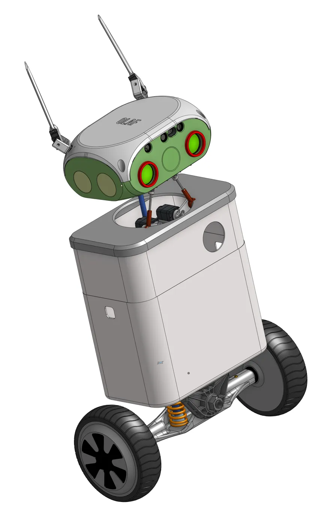

# 🤖 OLAF - Open Lovable AI Friend

**An open-source AI companion robot. Built in public.**

<p align="center">
  
</p>

<p align="center">
  <i>The tools to build your own JARVIS or R2D2 are finally here.</i>
</p>

---

## What is OLAF?

OLAF is a personality-first robotics framework that brings AI agents to physical life. A 2-3 foot tall companion with R2D2 charm meets modern AI capabilities—expressive eyes, articulated ears, animated heart display, and floor projection.

**This is not another voice assistant.** When you BUILD your AI companion, it becomes a partner, not a servant.

## Why OLAF?

AI assistants (Alexa, Siri, ChatGPT) are trapped in screens and speakers. Meanwhile, building physical AI with personality forces impossible choices: expensive commercial robots, purely utilitarian platforms, or simple hobbyist kits.

**The gap:** No open-source framework exists for embodied AI with personality that's maker-accessible.

**The opportunity:** 3D printers, powerful LLMs, modern SBCs, AI coding assistants—everything needed is finally accessible. This is the democratization moment. The future of embodied AI belongs to builders.

## The Build

**20 weeks:** From sketch → functioning prototype
**5 Modules:** Head, Ears, Neck, Torso, Base (all ESP32-powered)
**Built while:** Relocating cities + starting new job
**Status:** Physical foundation complete, integrating AI intelligence layer next

## Architecture

```
┌─────────────────────────────────────────────────────────┐
│         INTELLIGENCE LAYER (Hybrid AI)                  │
│  Local: Whisper STT (Hailo) | Cloud: Claude/GPT-4      │
└────────────────────┬────────────────────────────────────┘
                     │
┌────────────────────▼────────────────────────────────────┐
│         ORCHESTRATION LAYER                             │
│  Raspberry Pi 5 16GB + Hailo AI Kit (ROS2)              │
│  Personality Coordination • SLAM Navigation             │
└──┬─────┬─────┬──────┬──────┬───────────────────────────┘
   │     │     │      │      │
┌──▼──┐┌─▼──┐┌─▼───┐┌─▼───┐┌▼────┐
│HEAD ││EARS││NECK ││TORSO││BASE │
│ESP32││    ││     ││     ││     │
└─────┘└────┘└─────┘└─────┘└─────┘
```

**Module Layer:** Independent ESP32-powered modules (I2C communication)
**Orchestration:** ROS2 on Raspberry Pi 5 + Hailo AI Kit
**Intelligence:** Hybrid local AI (fast) + cloud agents (reasoning)

## Key Features

- 🎭 **Multi-channel expression:** OLED eyes, articulated ears/neck, beating heart display, R2D2 beeps
- 🧠 **Hybrid AI:** Local Whisper STT + cloud agents (Claude/GPT-4)
- 🔧 **Modular MECE architecture:** Weekend-sprint development, independent testing
- 📄 **Physical outputs:** Floor projection + thermal printer for lists/reminders
- 🚶 **Mobile:** Self-balancing base with SLAM navigation
- 📖 **Fully open:** Complete build docs, 3D files, wiring diagrams, code

## The Movement

This is the **Linux moment for physical AI**—open, collaborative, human-centric.

Build yours. Customize it for your needs: church assistant, teaching companion, eldercare helper. Join the community making embodied AI accessible.

## Current Status

✅ **Week 20:** Physical foundation complete (blinking cyan eyes!)
🔄 **Next:** AI intelligence layer integration
📅 **Follow:** Weekly progress updates on [LinkedIn](https://www.linkedin.com/in/kamal-singh)

## Documentation

- **[Project Brief](documentation/brief.md)** - Detailed architecture, MVP scope, technical decisions
- **Build Logs** - Coming soon
- **3D Models** - Coming soon
- **Wiring Diagrams** - Coming soon

## Built In Public

Progress shared weekly. Successes, failures, learnings—all documented transparently.

**Why?** To prove anyone can create their own JARVIS/R2D2 and build the community they can refer to for guidance.

---

**License:** Open Source (TBD: MIT or Apache 2.0)
**Builder:** [Kamal Singh](https://www.linkedin.com/in/kamal-singh)
**Tags:** #BuildInPublic #Robotics #ROS2 #PhysicalAI #OpenSource #MakerMovement

---

<p align="center">
  <i>"Feel alive first, be useful second."</i>
</p>
