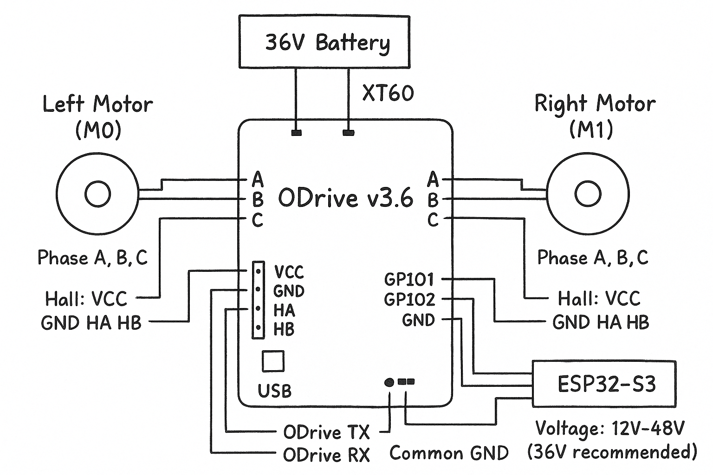
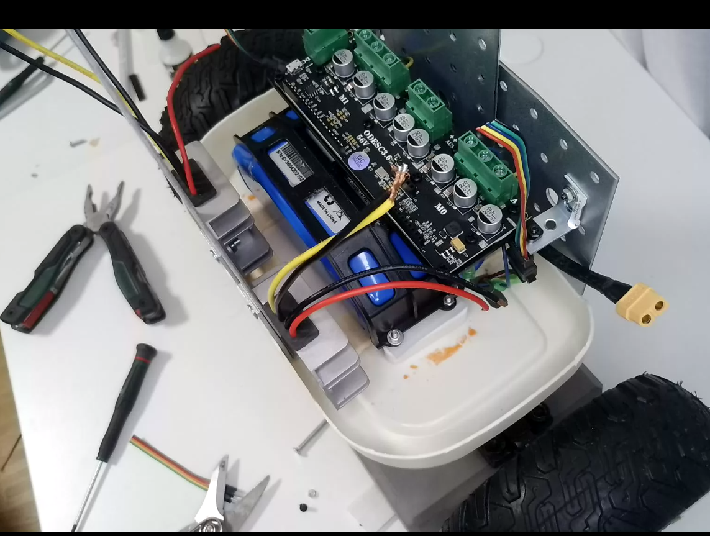
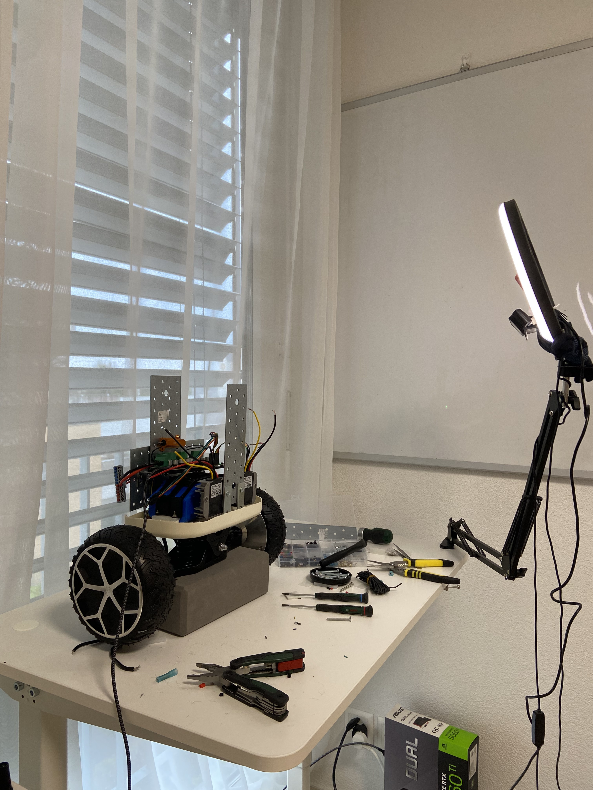

# Getting Your Hoverboard Motors Spinning with ODrive

**Part 2 of the Self-Balancing Robot Build**

---

## What We're Doing Today

In [Part 1](self-balancing-circuit-build-log.md), we built the mechanical rolling chassis with salvaged hoverboard parts. Now it's time to bring those motors to life.

Today we're going to:
1. **Wire up the ODrive** motor controller to the hoverboard motors
2. **Calibrate everything** so the ODrive knows how to talk to these motors
3. **Make them spin** from a PC first (proof it works)
4. **Connect an ESP32** and control motors via UART
5. **Test basic movement** - forward, reverse, turning

By the end, you'll have motors responding to commands from your microcontroller. No MPU/balancing yet—that comes next. One step at a time.

---

## Why ODrive?

I destroyed the original hoverboard controller trying to reverse-engineer it (classic). Could have gone with a cheap ESC or built something custom, but I wanted **proper velocity control** with encoder feedback, not just "spin fast" or "spin slow."

ODrive gives you:
- **Closed-loop velocity control** (you command "2 rev/s" and it maintains exactly that)
- **Hall sensor support** (hoverboard motors have hall sensors built-in)
- **UART interface** (perfect for ESP32 communication)
- **Professional-grade control** (this thing can handle way more than hobby projects)

Yeah, it's €58 (AliExpress clone, works perfectly). But it saved me weeks of PID tuning and motor driver debugging. Sometimes buying the right tool is faster than building it.


*ODrive v3.6 56V 24A motor controller - €58 on AliExpress*

---

## The Wiring

Here's what we're connecting:

### ODrive to Motors

**Each hoverboard motor has:**
- **3 thick wires** (phase wires: A, B, C) - these carry the power
- **5 thin wires** (hall sensors: VCC, GND, HA, HB, HC) - these tell the ODrive where the motor shaft is

**The ODrive has two motor ports: M0 (left) and M1 (right)**


*Complete wiring diagram: ODrive v3.6 connected to two hoverboard motors, power supply, and ESP32 for UART control*

---

## Step 1: Mounting the ODrive


*ODrive v3.6 mounted on the platform, ready for wiring*

### First Impressions

Honestly? I was surprised. I expected connecting to the ODrive to be complicated—lots of configuration files, obscure settings, trial and error. But it was **straightforward**. Way easier than I expected.

The ODrive tool (`odrivetool`) just works. Plug in USB, run the tool, and you're connected. From there, it provides an insane amount of customization. You can tune motor parameters, set velocity limits, configure encoder modes, adjust PID gains—basically every knob you'd ever want to turn.

This is what €58 buys you: professional-grade motor control without the usual hardware hacking headaches. Coming from destroying the original hoverboard controller, this felt like cheating in the best way possible.

---

## Step 2: Wiring Everything Up

Before we can calibrate, we need to connect:
- **Motors to ODrive** (phase wires + hall sensors)
- **Power supply to ODrive** (36V from the hoverboard battery)
- **USB cable to PC** (for calibration and initial setup)


*All wired up and ready for calibration. Note the USB cable connecting ODrive to the PC—this is essential for the initial setup.*

### The Connections

**Left Motor (Axis 0 / M0):**
- 3 thick phase wires → Blue screw terminals on M0 (A, B, C)
- 5 thin hall sensor wires → M0 hall header pins (VCC, GND, HA, HB, HC)

**Right Motor (Axis 1 / M1):**
- 3 thick phase wires → Blue screw terminals on M1 (A, B, C)
- 5 thin hall sensor wires → M1 hall header pins (VCC, GND, HA, HB, HC)

**Power:**
- 36V battery → ODrive XT60 connector (watch polarity!)

**USB:**
- ODrive → PC (for calibration only, we'll switch to ESP32 UART later)

When you power on, you should see a **green LED** on the ODrive. That means power is good and the board is alive.

---

## Step 3: Installing ODrive Tools

Before we calibrate, we need the ODrive Python tools installed on your PC.

**Install via pip:**

```bash
pip install odrive
```

That's it. This gives you:
- `odrivetool` - Interactive command-line tool
- Python library for scripting

**Test the connection:**

```bash
odrivetool
```

You should see:

```
ODrive control utility v0.5.x
Please connect your ODrive.
Connected to ODrive [serial number] as odrv0
In [1]:
```

If you see this, you're connected! Type `exit()` to quit for now.

---

## Step 4: The Magic Calibration Script

Now for the important part: teaching the ODrive about your specific motors.

I've packaged everything into one calibration script (located at `tools/diagnostics/odrive_test_and_calibrate.py`). This script:

1. Finds your ODrive on USB
2. Checks hall sensors are connected
3. Measures motor electrical properties (resistance, inductance)
4. Calibrates hall sensor positions
5. Tests velocity control
6. Saves everything to ODrive's non-volatile memory

**Run it:**

```bash
python tools/diagnostics/odrive_test_and_calibrate.py
```

### What You'll See

```
============================================================
  ODrive Test & Calibration - Hoverboard Motors
============================================================

[1/6] Connecting to ODrive...
      ✓ Connected! Voltage: 40.3V
      Firmware: 0.5.1

[2/6] Checking hall sensors...
      Axis 0 hall state: 2
      Axis 1 hall state: 2
      ✓ Hall sensors working

[3/6] Configuring for hoverboard motors...
      ✓ Configuration applied

[4/6] Testing motor phase wire connections...
      ✓ Axis 0 phase wires connected (0.257Ω)
      ✓ Axis 1 phase wires connected (0.297Ω)

[5/6] Running calibration sequence...
      Axis 0 calibrating... (motors will beep and spin)
      Axis 1 calibrating...
      ✓ Calibration complete

[6/6] Testing velocity control...
      Axis 0: Commanded 2 rev/s → Actual 1.97 rev/s ✓
      Axis 1: Commanded 2 rev/s → Actual 2.04 rev/s ✓

Saving configuration to ODrive memory...

============================================================
  ✅ SUCCESS! ODrive Setup Complete
============================================================

  Summary:
    • Axis 0 (Left):  0.257Ω, 540.56µH, Hall ready
    • Axis 1 (Right): 0.298Ω, 660.79µH, Hall ready
    • Velocity control: Working
    • Configuration: Saved permanently
```

**Your motors will beep and spin during calibration—that's normal!** The ODrive is measuring their electrical properties and learning the hall sensor positions.

### What Just Happened?

Here's what the script configured under the hood:

**Motor parameters:**
```python
# Hoverboard motors typically have 15 pole pairs
axis.motor.config.pole_pairs = 15

# Current limit (20A per motor is safe)
axis.motor.config.current_lim = 20

# Calibration voltage increased for low-resistance motors
axis.motor.config.resistance_calib_max_voltage = 12
```

**Encoder (hall sensor) configuration:**
```python
# Set encoder mode to hall effect sensors
axis.encoder.config.mode = ENCODER_MODE_HALL

# 15 pole pairs × 6 states = 90 counts per revolution
axis.encoder.config.cpr = 90
```

**Velocity control limits:**
```python
# Maximum velocity: 10 rev/s (safe limit)
axis.controller.config.vel_limit = 10

# Set control mode to velocity
axis.controller.config.control_mode = CONTROL_MODE_VELOCITY_CONTROL
```

**Critical fix for hoverboard motors:**
The default `resistance_calib_max_voltage` is 2V, but hoverboard motors have very low resistance (~0.25Ω). The calibration would fail without increasing this to 12V.

---

## Step 5: Manual Calibration (Understanding the Process)

Want to understand what the script does? Here's how to calibrate manually using `odrivetool`:

**Connect to ODrive:**
```bash
odrivetool
```

**Configure Axis 0 (left motor):**
```python
# Set motor parameters
odrv0.axis0.motor.config.pole_pairs = 15
odrv0.axis0.motor.config.current_lim = 20
odrv0.axis0.motor.config.resistance_calib_max_voltage = 12

# Configure hall sensor encoder
odrv0.axis0.encoder.config.mode = ENCODER_MODE_HALL
odrv0.axis0.encoder.config.cpr = 90

# Set velocity limits
odrv0.axis0.controller.config.vel_limit = 10
odrv0.axis0.controller.config.control_mode = CONTROL_MODE_VELOCITY_CONTROL

# Run calibration
odrv0.axis0.requested_state = AXIS_STATE_FULL_CALIBRATION_SEQUENCE
```

Wait for calibration to complete (motor will beep and spin). Then check:

```python
# Check if encoder is ready
odrv0.axis0.encoder.is_ready
# Should return: True
```

**Repeat for Axis 1 (right motor):**
```python
odrv0.axis1.motor.config.pole_pairs = 15
odrv0.axis1.motor.config.current_lim = 20
odrv0.axis1.motor.config.resistance_calib_max_voltage = 12
odrv0.axis1.encoder.config.mode = ENCODER_MODE_HALL
odrv0.axis1.encoder.config.cpr = 90
odrv0.axis1.controller.config.vel_limit = 10
odrv0.axis1.controller.config.control_mode = CONTROL_MODE_VELOCITY_CONTROL
odrv0.axis1.requested_state = AXIS_STATE_FULL_CALIBRATION_SEQUENCE
```

**Save configuration permanently:**
```python
odrv0.save_configuration()
odrv0.reboot()
```

**Important:** If you don't save and reboot, these settings are lost when you power cycle!

---

## Step 6: Testing - Let's Make Them Spin!

Now the fun part. Let's verify everything works by spinning the motors from Python.

**Simple test script:**

```python
import odrive
from odrive.enums import *
import time

# Connect to ODrive
print("Finding ODrive...")
odrv = odrive.find_any()
print(f"Connected! Voltage: {odrv.vbus_voltage:.1f}V")

# Enable motors
print("Enabling motors...")
odrv.axis0.requested_state = AXIS_STATE_CLOSED_LOOP_CONTROL
odrv.axis1.requested_state = AXIS_STATE_CLOSED_LOOP_CONTROL
time.sleep(0.5)

# Spin forward
print("Spinning forward at 2 rev/s...")
odrv.axis0.controller.input_vel = 2.0
odrv.axis1.controller.input_vel = 2.0
time.sleep(3)

# Stop
print("Stopping...")
odrv.axis0.controller.input_vel = 0
odrv.axis1.controller.input_vel = 0
time.sleep(1)

# Spin reverse
print("Spinning reverse at -2 rev/s...")
odrv.axis0.controller.input_vel = -2.0
odrv.axis1.controller.input_vel = -2.0
time.sleep(3)

# Stop and disable
print("Done!")
odrv.axis0.controller.input_vel = 0
odrv.axis1.controller.input_vel = 0
odrv.axis0.requested_state = AXIS_STATE_IDLE
odrv.axis1.requested_state = AXIS_STATE_IDLE
```

**Run it:**
```bash
python test_motors.py
```

Your motors should:
1. Spin forward for 3 seconds
2. Stop
3. Spin reverse for 3 seconds
4. Stop

**If they spin, you're golden!** Calibration was successful.

### Video: Calibration and First Spin

**[📹 Watch the calibration video](images/odrive-tutorial/calibration-test.webm)** _(Click to download and view)_

*Full calibration process and first test: motors beeping during calibration, then smoothly spinning forward and reverse under velocity control.*

> **Note:** If the video doesn't play in your browser, download it and open with VLC or your preferred video player.

---

## Understanding Velocity Commands

When you set `input_vel = 2.0`, what does that mean?

**Units: Revolutions per second (rev/s)**

- `2.0` = 2 rev/s = 120 RPM
- `10.0` = 10 rev/s = 600 RPM (our configured max)
- `-2.0` = 2 rev/s reverse

**Converting to linear speed:**

With 6.5" diameter wheels (0.165m):
- Circumference = π × 0.165m = 0.518m
- At 2 rev/s: Linear speed = 2 × 0.518m = **1.04 m/s** (about 2.3 mph)

So `input_vel = 2.0` moves your robot forward at walking speed.

---

_This is a living document. As I complete each step, I'll add the details, photos, code, and lessons learned._

---

**Current Status:** ✅ Calibration Complete - Motors spinning from PC

**Next Up:** ESP32 UART connection and wireless motor control

---
