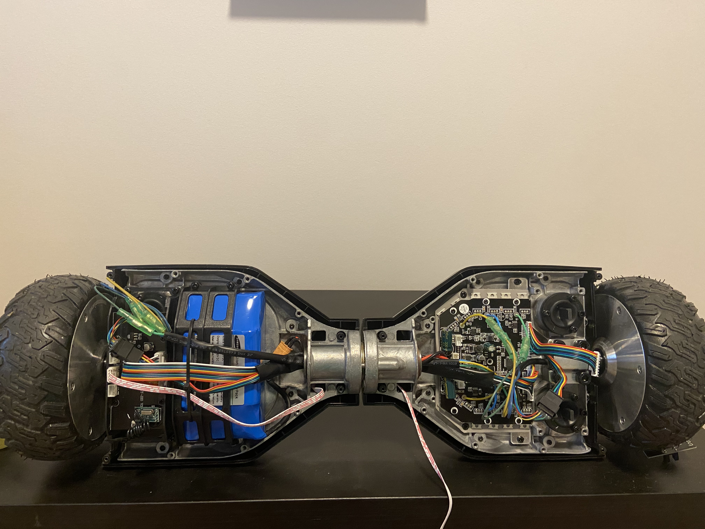
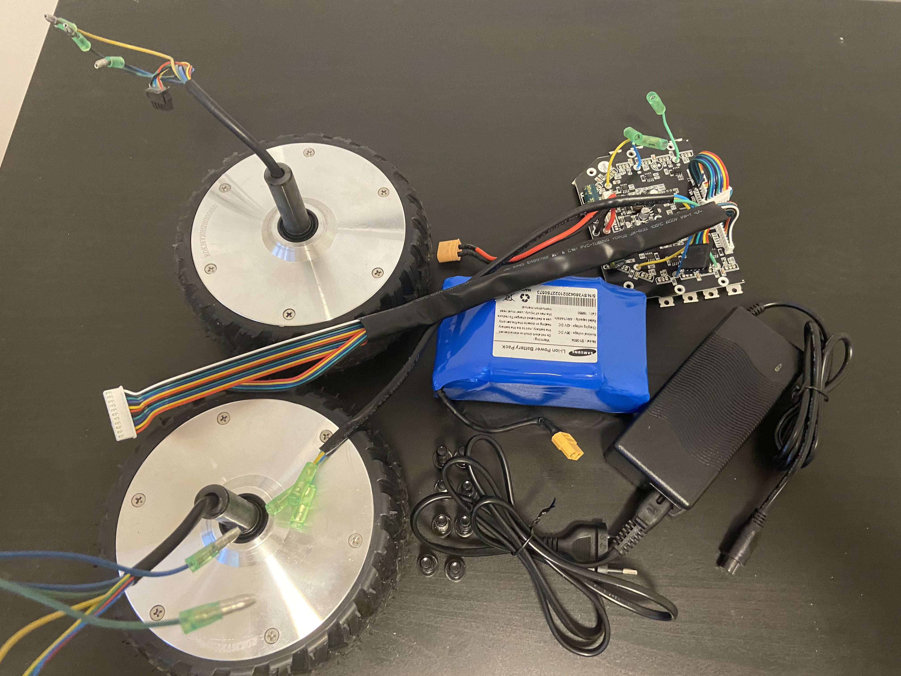
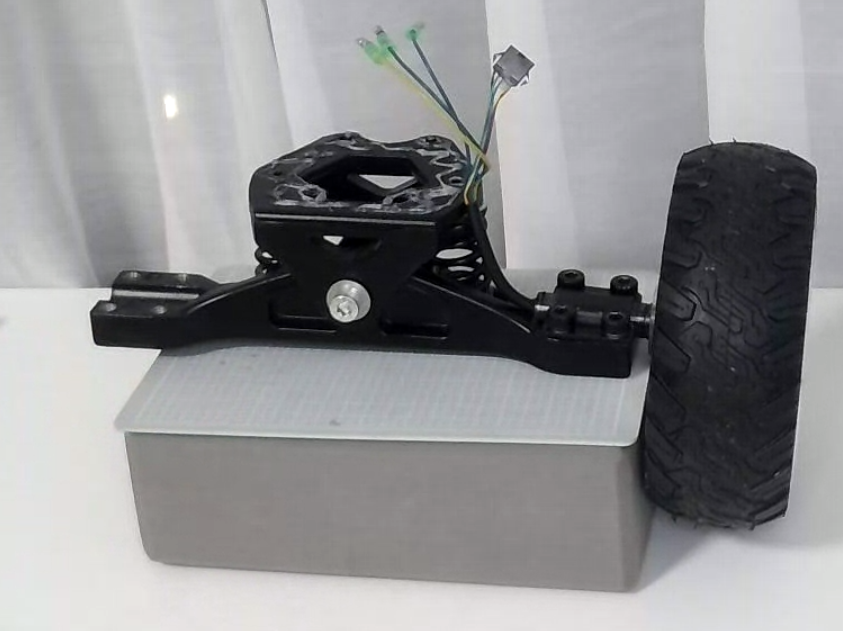
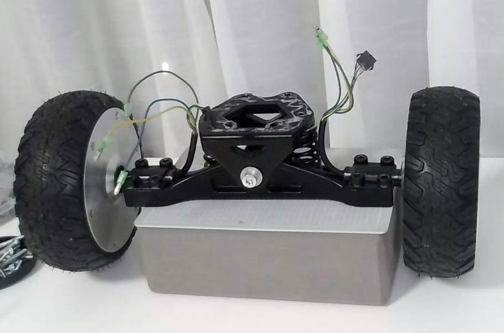
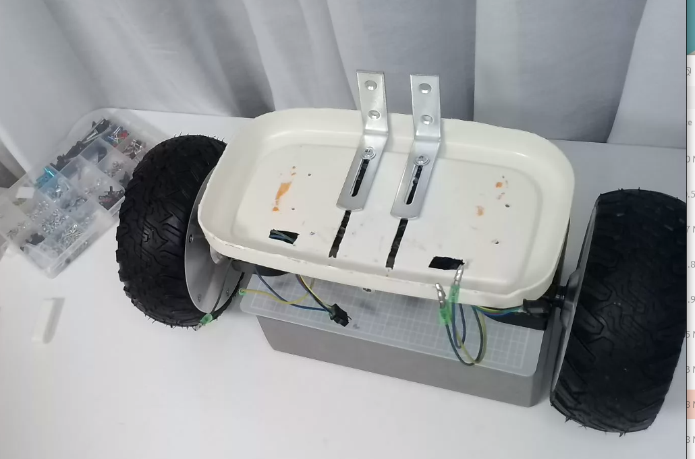
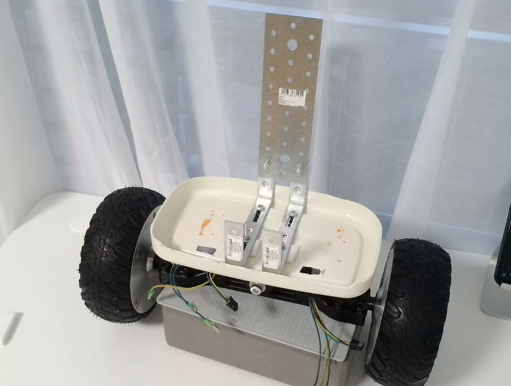
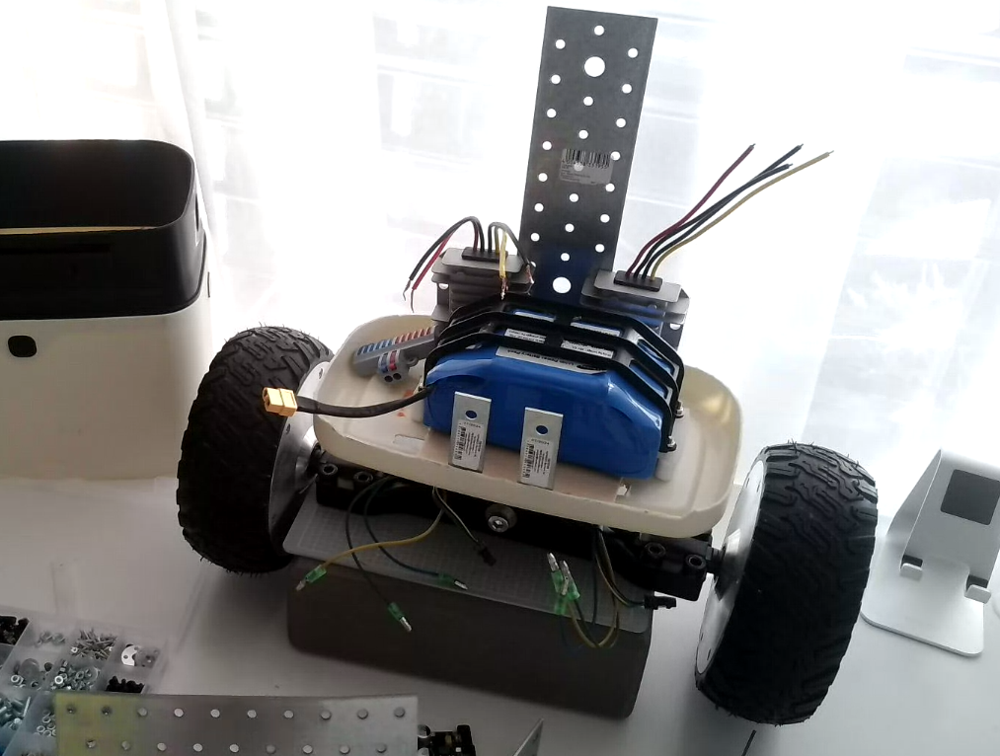

# Building OLAF's Self-Balancing Brain: A Perfboard Journey

**Torso & Wheels Build Log**

---

## The Mission

I'm creating a bot. Not just any bot—OLAF, an open-source AI companion that I'm building entirely in public to prove anyone can create their own JARVIS or R2D2 with modern accessible tools. This is my build-in-public journey, and this article documents one critical piece: **getting OLAF to balance and move**.

_If you're wondering "what's this OLAF thing about?", check out [the vision and mission here](./.content/usp-brainstorming-session.md). Short version: This is the Linux moment for physical AI—open, collaborative, builder-created companions instead of corporate servants._

---

## The Challenge

OLAF needs wheels. More specifically, OLAF needs to balance on two wheels without face-planting every five seconds, then eventually navigate around autonomously.

I salvaged two hoverboard motors and wheels from a broken board. These are beautiful pieces of hardware—brushless DC motors with built-in hall effect sensors, capable of precise velocity control. Perfect for a self-balancing robot.

But motors alone don't balance. I need a brain. A real-time control system that reads tilt angle 200 times per second, calculates corrections with PID control, and commands the motors to keep OLAF upright.

No fancy custom PCB. No expensive development kit. Just salvaged hoverboard motors, clever mechanical assembly, and the willingness to learn by doing.

## What We're Building

The **Base Module** circuit needs to:
- Read orientation data from an **MPU9250** IMU (9-axis, though we only need gyro + accel for balancing)
- Run a **200Hz PID loop** on the ESP32-S3 to calculate motor corrections
- Send velocity commands to the **ODrive v3.6** over UART (it's already configured and tested)
- Act as an **I2C slave at address 0x0B** so the Raspberry Pi orchestrator can send high-level movement commands
- Regulate power (5V for ESP32, 3.3V for IMU)

Think of it as the cerebellum—constantly making micro-adjustments to keep OLAF from tipping over while the higher-level brain (Raspberry Pi) worries about navigation and personality.

## The Components

Here's what's going into this build:

**Mechanical Base:**
- Salvaged hoverboard (€40) - 2 motors, 2 wheels, 4.4AH battery, charger, quality screws
- Skateboard mount with suspension (€50, AliExpress) - fits motors perfectly
- Kitchen bin as chassis (AliExpress) - stronger than 3D prints
- Metal perfboard plates and L-brackets for mounting

**Brains & Sensors:**
- ESP32-S3-DevKitC-1 (dual-core 240MHz, perfect for real-time control)
- MPU9250 IMU (gyro + accel for tilt sensing, magnetometer for future compass work)
- ODrive v3.6 motor controller (the clean solution after destroying the original board)

**Power & Regulation:**
- AMS1117-3.3V voltage regulator (the IMU is picky about 3.3V)
- Capacitors (100µF, 10µF, 0.1µF—keeping things stable)
- 5V input from the hoverboard's battery system

## Why Hoverboard Parts?

**Because the market is flooded with lightly-used, quality hardware at ridiculous prices.**

Hoverboards had their moment. Millions were sold. Many sat in garages. Now they're being dumped on the secondhand market for next to nothing.

What you get for €40-60:
- **Two brushless DC motors** (350W each, designed to carry 100+ kg)
- **Hall effect sensors** built-in (for precise velocity control)
- **Two solid rubber wheels** (6.5" diameter, ready to go)
- **4.4AH battery** with BMS (36V lithium, perfect for robotics)
- **Charger** included (42V, 2A)
- **Quality screws and hardware** (better than buying separately)

The motors are beautiful pieces of engineering: no complicated gear trains, direct drive, smooth and powerful. They're made to handle abuse—these things were ridden by kids doing tricks on concrete.

And here's the kicker: even if you destroy the original controller board while hacking it apart (ask me how I know), you've still got premium motors and wheels for less than buying them new would cost.

## The Plan

We're taking this **one baby step at a time**. No rushing. Test everything before moving forward.

1. **Hoverboard mechanical assembly** - Build the rolling chassis with salvaged parts
2. **ODrive setup** - Wire and configure the motor controller
3. **Control circuit** - ESP32 + MPU9250 on perfboard for the balancing brain
4. **Integration** - Connect everything and tune the PID loop
5. **First balance** - Watch OLAF stand upright

Each step gets documented with photos, measurements, mistakes, and lessons learned. Because that's how we actually learn—not from the perfect writeup, but from the "oh crap, I wired that backwards" moments.

## Let's Build

Alright, enough intro. Time to heat up the soldering iron.

---

_This is a living document. As we complete each build step, we'll add the details, photos, measurements, and war stories right here. Check back to follow the journey._

---

---

## Step 1: The €90 Rolling Chassis

**Goal:** Turn hoverboard salvage + AliExpress parts into a rolling platform.

### The Shopping List

Here's what I actually bought (total: ~€90):

- **Hoverboard (€40, Facebook Marketplace)**
  Salvaged from someone's garage. The control board was toast, but motors, wheels, battery, and charger all worked perfectly. Even came with quality screws.

- **Skateboard truck mount (€50, AliExpress)**
  This was the find. A proper skateboard mount designed for these exact hoverboard motors. Bonus: it has built-in suspension. Fits like it was made for this (because it basically was).

- **Kitchen bin (AliExpress)**
  Yeah, a kitchen bin. Turned out to be way cleaner and stronger than 3D printing a custom chassis. Perfect size, rigid plastic, ready-made mounting points. Sometimes the simple solution is the best solution.

- **Metal perforated plates + L-brackets (hardware store)**
  For mounting electronics later. Strong, easy to work with, infinitely configurable.

### The Build

I started with big plans to use the original hoverboard controller board. Tried to reverse-engineer it, trace out the circuits, figure out the pinouts...

And promptly destroyed it.

Lesson learned: sometimes hacking hardware means literally breaking it. That's when I decided to go with the ODrive motor controller instead. More expensive (€120), but a *much* cleaner solution. It's designed specifically for this—BLDC motor control with hall sensor feedback, UART communication, velocity mode control. Exactly what I needed.

The skateboard mount was brilliant. Drop the motors in, bolt them down, done. The suspension even gives some compliance for rough surfaces later.

The kitchen bin? Cut some mounting holes, attach the skateboard truck, and suddenly I have a rigid chassis that can hold a 4.4AH battery, ODrive controller, and eventually the entire electronics stack.

Metal perfboard plates get bolted to the bin for mounting the control electronics. L-brackets secure everything.

Total assembly time: maybe 2 hours of actual work spread over a weekend.

### The Photos

**Hoverboard Parts (Salvaged)**

*Two brushless motors with hall sensors, solid rubber wheels, battery, charger, and all the hardware. €40 well spent.*

**Hoverboard Parts (Salvaged)**

*parts that I salvaged* 

**Kitchen bin I used**

*Who says you need 3D printing? This bin is stronger, cleaner, and was ready to go.*

**Skateboard Mount with Motor & Wheel**

*The skateboard truck mount with hoverboard motor installed and wheel attached. You can see the suspension mechanism and the motor phase wires with green connectors. Sitting on the kitchen bin chassis.*

**Both Motors Mounted**

*Both hoverboard motors and wheels mounted on the skateboard truck. Front view showing the clean assembly sitting on the kitchen bin base.*

**Top View with Mounting Tray**

*Top view showing the white mounting tray secured with metal L-brackets. This is where the electronics will live. You can see the motor wires routed underneath.*

**Vertical Mounting Plate Added**

*Added a vertical metal perforated plate for mounting additional electronics. The modular mounting system gives lots of flexibility for component placement.*

**Battery and Power Converters Added**

*The 4.4AH hoverboard battery and two buck converters mounted on the platform. The battery provides 36V, and the buck converters step it down to 12V and 5V for different components. ODrive comes next.*

### What I Learned

**1. Salvage First, Buy New Later**
€40 for motors + wheels + battery + charger is unbeatable. The market is flooded with these things.

**2. Sometimes Off-the-Shelf Beats Custom**
That skateboard mount saved me weeks of CAD work and 3D printing iterations. The kitchen bin saved me from trying to print a giant chassis in pieces.

**3. Don't Be Afraid to Destroy Things**
I killed the original controller board. But that failure led me to the ODrive, which is actually a better solution for this project. Sometimes breaking things is how you learn what you really need.

**4. Quality Hardware Matters**
These hoverboard motors are *nice*. Smooth, powerful, built to take abuse. The hall sensors are accurate. The wheels are solid. When you salvage good hardware, you're starting from a strong foundation.

### Budget Check

| Item | Cost |
|------|------|
| Hoverboard (motors, wheels, battery, charger) | €40 |
| Skateboard truck mount with suspension | €50 |
| Kitchen bin chassis + white mounting tray | ~€10 |
| Metal perfboard + L-brackets | ~€15 |
| Buck converters (36V→12V, 36V→5V) | ~€10 |
| **Total** | **€125** |

_(ODrive controller €120 comes in Step 2)_

For €125, I have a rolling platform with motors, wheels, complete power system (battery + voltage regulation), and modular chassis. The foundation is solid.

### Step 1 Wrap-Up

The mechanical foundation is done. Two powerful hoverboard motors mounted on a skateboard truck with suspension, all sitting on a rigid kitchen bin chassis with modular metal mounting plates. The power system is in place—battery and buck converters ready to supply 36V, 12V, and 5V to everything that needs it.

What started as a €40 salvage operation turned into a solid rolling platform for just €125. The beauty of using off-the-shelf parts (skateboard mount, kitchen bin) is that I didn't waste weeks on CAD and 3D printing. I got straight to building.

Next up: adding the ODrive motor controller and making these motors actually spin.

---

### Next Up

Step 2: Wiring and configuring the ODrive motor controller. Time to make these motors spin.

---

**Current Status:** ✅ Step 1 Complete - Rolling chassis built

**Next Step:** Step 2 - ODrive motor controller setup

---
